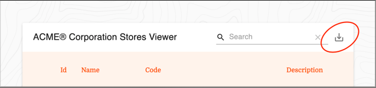
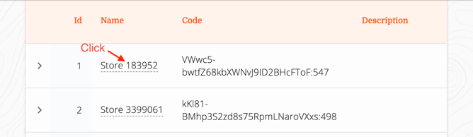

# ACME Corporation – [Alexandre Ramalho](https://alramalho.com)
<sup>Challenged by software angels</sup>

## Running
Go to the root of the project and run
```
docker-compose up
```

Please make sure you have `docker` and `docker-compose` installed.

The frontend app will be accessible through `localhost:8080` and the backend app through `localhost:7000`

As soon as you start it backend will start the async job of importing information. This may take a few seconds 
before its visible in the frontend. (<1min)

## Methodology
- Agile, tried to follow full stack story approach
- TDD
- UX driven
- Lean & KISS
- Clean architecture

## Guidelines

#### Downloading CSV:


#### Editing name:



## Design decisions
- No "hard" documentation
  - Tests should be the only documentation, "hard" documentation is one more thing that
    can get outdated and needs active effort to be kept up to date. If testes are
    rightly written in a behaviour driven way, they will serve as documentation,
    giving live working examples of the code, while explaining them.
- Relational database as PostgreSQL
    - I kinda of feel this is an overkill, and thought about going with some simpler solutions. 
      Although, since I know it is used in the project I'm applying for, and since I
      wanted to get more experienced with it, I've decided to go for it
- Exposed API Key, database user and password
    - I understood that security was not part of the evaluation criteria. 
- All stores fields nullable except id add name. Was following the KISS and lean principle,
  since the id was the identifier it couldn't be null, and name was editable, I figured it made sense
  not to allow it to be null.
- Store `code` size of 1500
  - Nothing was specified in the API regarding special treatment on `code` parameter, therefore no spaces were trailed.
- CronJob as coroutine
  - I started by doing the cronjob as a separate application, running parallelly to the webapp. I feel like this also works,
  but coroutines and meant to be lightweight, and a routine on a global scope seemed like the leanest way to go.
- Explicit wait on API before launching. 
  - API was being too fast to boot up and would fail before DB was up. Since docker had no predefined way to deal with 
  this I went with a small explicit await that should be enough to solve all this problems.
    
## Possible optimizations

- Use yarn instead of npm in docker compose, faster boot times
- Silence warnings when running backend
- Use Enum for season half instead of varchar in DB
- Do not hardcode SQL code (to use FK of stores_seasons table). Related to [this issue](https://github.com/JetBrains/Exposed/issues/511)
- Use more specific exceptions throughout the code
- Refactor CSV logic in the Handler, it doesn't read too well, and could be improved.
